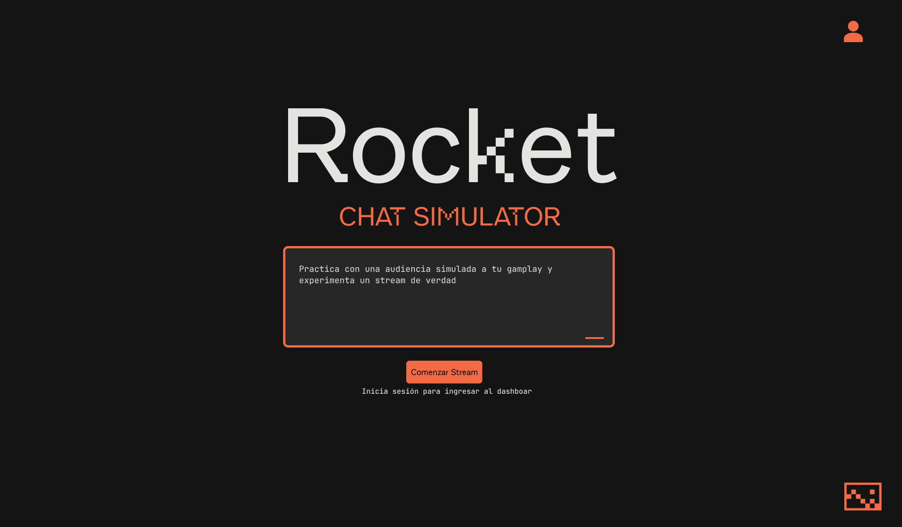

# Chat Simulation Stream



Plataforma web para streamers principiantes que simula una audiencia interactiva en tiempo real. Genera mensajes de chat contextuales por videojuego usando IA.

## Stack Tecnologico

| Categoria        | Tecnologia                |
|------------------|---------------------------|
| Framework        | Astro 5 (SSR)             |
| UI               | React 19 + Tailwind CSS 4 |
| Autenticacion    | Clerk                     |
| IA Primario      | Groq SDK                  |
| IA Fallback      | Cerebras Cloud SDK        |
| Lenguaje         | TypeScript                |
| Package Manager  | pnpm                      |

## Requisitos Previos

- Node.js 18+
- pnpm 8+
- Cuenta en [Clerk](https://clerk.com)

## Configuracion


```env
# Obligatorias - Clerk Auth
PUBLIC_CLERK_PUBLISHABLE_KEY=pk_test_xxx
CLERK_SECRET_KEY=sk_test_xxx

# Opcionales - IA (sin estas, se usan frases hardcodeadas)
GROQ_API_KEY=xxx
CEREBRAS_API_KEY=xxx
```

2. Instala dependencias y ejecuta:

```bash
pnpm install
pnpm dev
```

La app queda disponible en `http://rocket.netlify.app`.

## Scripts Disponibles

```bash
pnpm dev      # Servidor de desarrollo
pnpm build    # Build de produccion
pnpm preview  # Preview del build
```

## Estructura del Proyecto

```
chat-simulation-stream/
├── src/
│   ├── components/           # Componentes React
│   │   ├── StreamerDashboard.tsx
│   │   ├── ChatWindow.tsx
│   │   ├── ChatMessage.tsx
│   │   └── GameInput.tsx
│   ├── lib/                  
│   │   ├── ai/               # Servicios de IA
│   │   │   ├── serviceManager.ts
│   │   │   ├── types.ts
│   │   │   └── services/
│   │   │       ├── groq.ts
│   │   │       └── cerebras.ts
│   │   ├── chatGenerator.ts
│   │   ├── messagePatterns.ts
│   │   └── phraseCache.ts
│   ├── pages/
│   │   ├── api/
│   │   │   ├── chat-stream.ts
│   │   │   └── generate-phrases.ts
│   │   ├── dashboard.astro
│   │   └── index.astro
│   └── middleware.ts
├── astro.config.mjs
└── package.json
```

## Endpoints de la API

| Endpoint                   | Metodo | Descripcion                           |
|----------------------------|--------|---------------------------------------|
| `/api/chat-stream?game=X`  | GET    | Stream SSE de mensajes de chat        |
| `/api/generate-phrases`    | POST   | Genera frases con IA para un juego    |
| `/api/generate-phrases`    | GET    | Obtiene juegos del usuario y slots    |

## Rutas de la Aplicacion

| Ruta         | Protegida | Descripcion            |
|--------------|-----------|------------------------|
| `/`          | No        | Landing page           |
| `/sign-in`   | No        | Login con Clerk        |
| `/sign-up`   | No        | Registro con Clerk     |
| `/dashboard` | Si        | Panel del streamer     |

---

# Casos de Estudio

Esta seccion documenta patrones y tecnicas implementadas en el proyecto que son valiosas para tu aprendizaje.

---

## Caso 1: Server-Sent Events (SSE) para Streaming en Tiempo Real

**Archivo:** `src/pages/api/chat-stream.ts`

### Problema
Necesitamos enviar mensajes de chat al cliente cada 3-7 segundos sin que el cliente haga polling constante.

### Solucion: SSE con ReadableStream

```typescript
export const GET: APIRoute = async ({ request, url }) => {
  const gameName = url.searchParams.get('game');

  // Crear stream de texto para SSE
  const stream = new ReadableStream({
    async start(controller) {
      const encoder = new TextEncoder();

      const sendMessage = () => {
        try {
          const message = generateMessage(gameName);
          const data = `data: ${JSON.stringify(message)}\n\n`;
          controller.enqueue(encoder.encode(data));
        } catch (error) {
          console.error('Error generando mensaje:', error);
        }
      };

      // Funcion recursiva para programar mensajes
      const scheduleNext = () => {
        const interval = getRandomInterval(3000, 7000);
        return setTimeout(() => {
          sendMessage();
          timeoutId = scheduleNext();
        }, interval);
      };

      let timeoutId = scheduleNext();

      // Limpiar cuando el cliente cierra la conexion
      request.signal.addEventListener('abort', () => {
        clearTimeout(timeoutId);
        controller.close();
      });
    }
  });

  return new Response(stream, {
    headers: {
      'Content-Type': 'text/event-stream',
      'Cache-Control': 'no-cache',
      'Connection': 'keep-alive'
    }
  });
};
```

### Conceptos Clave

1. **ReadableStream**: API nativa del browser/Node para crear streams de datos
2. **TextEncoder**: Convierte strings a Uint8Array (bytes)
3. **Formato SSE**: Cada mensaje debe ser `data: contenido\n\n`
4. **AbortSignal**: Detecta cuando el cliente cierra la conexion

### Consumo en el Cliente

```typescript
// En StreamerDashboard.tsx
const eventSource = new EventSource(`/api/chat-stream?game=${encodeURIComponent(selectedGame)}`);

eventSource.onmessage = (event) => {
  const newMessage = JSON.parse(event.data);
  setMessages((prev) => [...prev, newMessage]);
};

eventSource.onerror = () => {
  console.error('Error en conexion SSE');
  eventSource.close();
};
```

### Por que SSE y no WebSockets?
- SSE es **unidireccional** (servidor -> cliente)
- Mas simple de implementar
- Reconexion automatica nativa
- Ideal cuando solo el servidor envia datos

---

## Caso 2: Patron Strategy + Failover para Servicios de IA

**Archivos:** `src/lib/ai/types.ts`, `src/lib/ai/serviceManager.ts`, `src/lib/ai/services/*.ts`

### Problema
Queremos usar multiples proveedores de IA (Groq, Cerebras) e intercambiarlos sin cambiar el codigo consumidor. Ademas, si uno falla, usar automaticamente el siguiente.

### Solucion: Interfaz Comun (Strategy Pattern)

```typescript
// src/lib/ai/types.ts
export interface AIService {
  name: string;
  chat: (messages: AIServiceMessage[]) => Promise<AsyncGenerator<string>>;
}
```

Cada servicio implementa esta interfaz:

```typescript
// src/lib/ai/services/groq.ts
export const groqService: AIService = {
  name: 'Groq',
  async chat(messages: AIServiceMessage[]) {
    const groq = getGroqClient();
    
    const chatCompletion = await groq.chat.completions.create({
      messages,
      model: 'openai/gpt-oss-120b',
      temperature: 0.7,
      stream: true,
    });

    async function* generateStream() {
      for await (const chunk of chatCompletion) {
        yield chunk.choices[0]?.delta?.content || '';
      }
    }

    return generateStream();
  }
};
```

### Failover Automatico

```typescript
// src/lib/ai/serviceManager.ts
const services: AIService[] = [groqService, cerebrasService];
let currentServiceIndex = 0;

function getNextService(): AIService {
  const service = services[currentServiceIndex];
  currentServiceIndex = (currentServiceIndex + 1) % services.length;
  return service;
}

export async function chatWithAI(messages: AIServiceMessage[]): Promise<string> {
  let lastError: Error | null = null;
  
  // Intentar con cada servicio hasta que uno funcione
  for (let i = 0; i < services.length; i++) {
    const service = getNextService();
    
    try {
      console.log(`[AI] Usando servicio: ${service.name}`);
      const stream = await service.chat(messages);
      
      let fullResponse = '';
      for await (const chunk of stream) {
        fullResponse += chunk;
      }
      
      return fullResponse;
    } catch (error) {
      console.error(`[AI] Error con ${service.name}:`, error);
      lastError = error as Error;
      // Continuar con el siguiente servicio
    }
  }
  
  throw lastError || new Error('Todos los servicios de IA fallaron');
}
```

### Conceptos Clave

1. **Strategy Pattern**: Define familia de algoritmos intercambiables
2. **Round-Robin**: Distribuye carga entre servicios con `(index + 1) % length`
3. **Failover**: Si un servicio falla, intenta con el siguiente
4. **Async Generators**: `async function*` + `yield` para streaming

### Beneficio
Para agregar un nuevo proveedor de IA, solo creas un nuevo archivo que implemente `AIService` y lo agregas al array.

---

## Caso 3: Patron Singleton Lazy para Clientes de API

**Archivo:** `src/lib/ai/services/groq.ts`

### Problema
No queremos crear multiples instancias del cliente Groq cada vez que se hace una peticion.

### Solucion: Singleton con Inicializacion Lazy

```typescript
let groqInstance: Groq | null = null;

function getGroqClient(): Groq {
  if (!groqInstance) {
    const apiKey = import.meta.env.GROQ_API_KEY;
    if (!apiKey) {
      throw new Error('GROQ_API_KEY no esta configurada');
    }
    groqInstance = new Groq({ apiKey });
  }
  return groqInstance;
}
```

### Por que es importante?

1. **Eficiencia**: Una sola instancia reutilizada
2. **Lazy Loading**: Solo se crea cuando se necesita
3. **Validacion**: Falla temprano si falta la API key

---

## Caso 4: Cache en Memoria con Map

**Archivo:** `src/lib/phraseCache.ts`

### Problema
No queremos llamar a la IA cada vez que un usuario usa el mismo juego. Necesitamos cache y limitar cuantos juegos puede generar cada usuario.

### Solucion: Dos Maps con Normalizacion

```typescript
// Cache de frases por juego
const phrasesCache = new Map<string, CachedGame>();

// Cache de juegos por usuario
const userGamesCache = new Map<string, UserGames>();

// Normalizar para consistencia
export function normalizeGameName(gameName: string): string {
  return gameName.toLowerCase().trim();
}

export function getCachedPhrases(gameName: string): MessagePattern | null {
  const key = normalizeGameName(gameName);
  const cached = phrasesCache.get(key);
  return cached?.phrases || null;
}

export function setCachedPhrases(gameName: string, phrases: MessagePattern, userId: string): void {
  const key = normalizeGameName(gameName);
  phrasesCache.set(key, {
    phrases,
    generatedAt: Date.now(),
    generatedBy: userId
  });
}
```

### Limite por Usuario

```typescript
const MAX_GAMES_PER_USER = 4;

export function canUserAddGame(userId: string): boolean {
  const userGames = getUserGames(userId);
  return userGames.length < MAX_GAMES_PER_USER;
}

export function addGameToUser(userId: string, gameName: string): boolean {
  const normalizedName = normalizeGameName(gameName);
  const userGames = userGamesCache.get(userId);
  
  if (userGames) {
    // Ya tiene el juego? No cuenta como nuevo
    if (userGames.games.includes(normalizedName)) {
      return true;
    }
    
    // Verificar limite
    if (userGames.games.length >= MAX_GAMES_PER_USER) {
      return false;
    }
    
    userGames.games.push(normalizedName);
  } else {
    userGamesCache.set(userId, {
      games: [normalizedName],
      createdAt: Date.now()
    });
  }
  
  return true;
}
```

### Conceptos Clave

1. **Map vs Object**: Map es mas eficiente para caches dinamicos
2. **Normalizacion**: Evita duplicados por mayusculas/espacios
3. **Datos efimeros**: Se pierden al reiniciar el servidor (aceptable para este caso)

---

## Caso 5: Seleccion Aleatoria Ponderada

**Archivo:** `src/lib/chatGenerator.ts`

### Problema
Queremos que los mensajes de gameplay aparezcan mas seguido (40%) que los emotes (10%).

### Solucion: Pesos con Suma Acumulada

```typescript
function getRandomCategory(): MessageCategory {
  const categories: MessageCategory[] = ['gameplay', 'reactions', 'questions', 'emotes'];
  const weights = [0.4, 0.3, 0.2, 0.1]; // 40%, 30%, 20%, 10%
  
  const random = Math.random(); // 0 a 1
  let sum = 0;
  
  for (let i = 0; i < categories.length; i++) {
    sum += weights[i];
    if (random < sum) {
      return categories[i];
    }
  }
  
  return 'gameplay'; // Fallback
}
```

### Como Funciona

Si `random = 0.35`:
- `sum = 0.4` -> `0.35 < 0.4` -> Devuelve 'gameplay'

Si `random = 0.65`:
- `sum = 0.4` -> `0.65 < 0.4`? No
- `sum = 0.7` -> `0.65 < 0.7`? Si -> Devuelve 'reactions'

---

## Caso 6: Middleware de Autenticacion con Clerk

**Archivo:** `src/middleware.ts`

### Problema
Proteger rutas `/dashboard` y `/api/*` para que solo usuarios autenticados accedan.

### Solucion: Middleware de Astro + Clerk

```typescript
import { clerkMiddleware, createRouteMatcher } from '@clerk/astro/server';

const isProtectedRoute = createRouteMatcher([
  '/dashboard(.*)',
  '/api/(.*)'
]);

export const onRequest = clerkMiddleware((auth, context) => {
  const { redirectToSignIn, userId } = auth();
  
  if (!userId && isProtectedRoute(context.request)) {
    return redirectToSignIn();
  }
});
```

### Conceptos Clave

1. **createRouteMatcher**: Crea un matcher con patrones glob
2. **clerkMiddleware**: Wrapper que inyecta `auth()` en cada request
3. **Patron temprano**: Verifica autenticacion antes de procesar la ruta

---

## Caso 7: Limpieza de Recursos con useEffect

**Archivo:** `src/components/StreamerDashboard.tsx`

### Problema
Si el usuario navega fuera del dashboard sin detener el chat, la conexion SSE queda abierta.

### Solucion: Cleanup en useEffect

```typescript
const eventSourceRef = useRef<EventSource | null>(null);

const handleStartChat = () => {
  const eventSource = new EventSource(`/api/chat-stream?game=...`);
  eventSourceRef.current = eventSource;
  // ...
};

const handleStopChat = () => {
  if (eventSourceRef.current) {
    eventSourceRef.current.close();
    eventSourceRef.current = null;
  }
};

// Cleanup al desmontar el componente
useEffect(() => {
  return () => {
    if (eventSourceRef.current) {
      eventSourceRef.current.close();
    }
  };
}, []);
```

### Por que useRef y no useState?

- `useRef` no causa re-renders al cambiar
- Perfecto para guardar referencias a objetos mutables
- El valor persiste entre renders

---

## Personalizacion Rapida

### Agregar un Juego Hardcodeado

1. Agrega frases en `src/lib/messagePatterns.ts`
2. Mapea el nombre en el objeto `hardcodedMapping` de `src/lib/phraseCache.ts`

### Ajustar Frecuencia de Mensajes

Modifica el rango en `src/pages/api/chat-stream.ts`:

```typescript
const interval = getRandomInterval(3000, 7000); // min, max en ms
```

### Cambiar Limite por Usuario

Edita `MAX_GAMES_PER_USER` en `src/lib/phraseCache.ts`.

---

## Servidor Alternativo (Bun)

La carpeta `api/` contiene un servidor Bun opcional con SSE. Usalo solo si quieres separar el streaming del SSR principal.

---

## Agradecimientos

Gracias a la herramienta de [@midu](https://github.com/midudev) para modelos de IA con capa gratuita.
